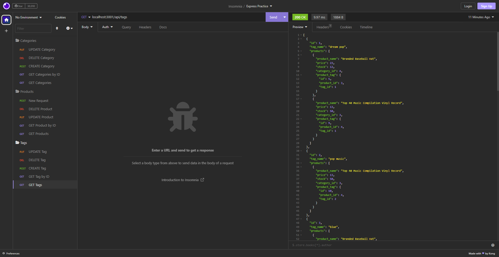

# 13-e-commerce-backend
      
## [Description](#table-of-contents)
A database and application backend for a (theoretical) e-commerce site, using MySQL, Express, Sequelize and dotenv.

## Table-of-Contents
* [Description](#description)
* [Installation](#installation)
* [Usage](#usage)
* [License](#license)
* [Contributing](#contributing)
* [Tests](#tests)
* [FAQs](#faqs)
   
## [Installation](#table-of-contents)
`npm init`

`npm install mysql2`

`npm install sequelize`

`npm install dotenv`
   
## [Usage](#table-of-contents)

`mysql -u root -p`

Enter PW when prompted

`source db/schema.sql`

`quit`

`npm run seed`
  
`npm start`
       

### Demonstration of creating the schema from MySQL shell, seeding the database, and starting the application server
https://drive.google.com/file/d/1uMHLcfCCZhrWuOVlZJyra8BclxyE9rHc/view?usp=drive_link

### Demonstration of GET, POST, PUT, DELETE routes for Categories
https://drive.google.com/file/d/1HOAw4f0Tgj9xVfeLZ0xlp2GjzjTY-ncM/view?usp=drive_link

### Demonstration of GET, POST, PUT, DELETE routes for Products
https://drive.google.com/file/d/1av1wHKJyuZQp4mZ0wLeLqBF0bm6zBu47/view?usp=drive_link

### Demonstration of GET, POST, PUT, DELETE routes for Tags
https://drive.google.com/file/d/1evtZjW5PH7IgreJge1GOvp9A0bfFSIf3/view?usp=drive_link

### Demonstration of GET routes for a single category/product/tag
https://drive.google.com/file/d/1trxNPdp3b30D4cTjkmWOxHcex4Q1uQtX/view?usp=drive_link

## [license](#table-of-contents)

Your repository is licensed under an mit open source license, so other people can contribute more easily.More information can be found by clicking this [link.](https://choosealicense.com/licenses/mit)

## [Contributing](#table-of-contents)
If you want to:
* Suggest a feature
* Report an issue
* Improve documentation
* Contribute to the code

Feel free to pull 
   
GitHub [issues page](https://github.com/katyn-sh/13-e-commerce-backend/issues) 
   
## [Tests](#table-of-contents)
No current testing guidelines
   
## [FAQs](#table-of-contents)
Contact Information:

[GitHub](https://github.com/katyn-sh) / Email: tanhung.huynh@protonmail.ch